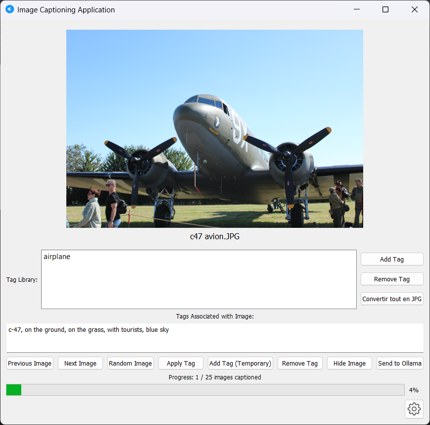

This project is a small script designed to help manual captioning of an image database. It requires python and Pillow if you use source code.


## Installation
First, clone this repo
```
git clone https://github.com/Wylgrif/Captioninghelper
```
Then you need python with this library to run this code
```
pip install pillow pyqt5
```
Run Main .py to use this programm.
You must have Ollama with Lava(or another vision llm) to use the autocaptioning feature.
